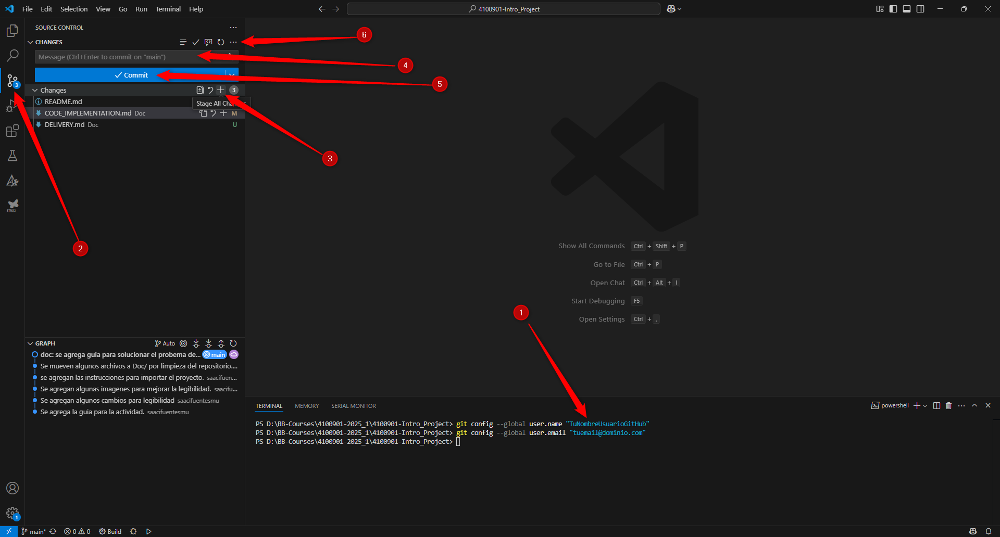

### Guía para subir y compartir tu trabajo usando VS Code

Ahora subiremos los cambios usando el control de versiones de VS Code:

#### Paso a paso:

**1. Configura Git (solo necesario la primera vez)**:
- Asegúrate de que tu correo y nombre coincidan con tu cuenta de GitHub.
- Abre la terminal en VS Code [`Ctrl+ñ`], o el CMD de Windows, y ejecuta estos comandos (reemplaza con tus datos):

```bash
git config --global user.name "TuNombreUsuarioGitHub"
git config --global user.email "tuemail@dominio.com"
```

**2. Añade tus cambios (stage)**:
- En VS Code, presiona `Ctrl+Shift+G` para abrir el panel de **Control de versiones**.
- Verás una lista de cambios realizados.
- Haz clic en el ícono `+` junto a cada archivo para seleccionarlos, o haz clic en `+` junto a "Cambios" para seleccionarlos todos.

**3. Haz commit de tus cambios:**
- En la parte superior del panel de control de versiones, escribe un mensaje claro y breve que explique tus cambios (ej. "Implementado driver UART").
- Haz clic en la marca de verificación (✔️) o presiona `Ctrl+Enter` para hacer commit.

**4. Sube (push) tus cambios a GitHub:**
- Luego de hacer commit, haz clic en los tres puntos (`...`) en la parte superior del panel de control de versiones.
- Selecciona "Push" para subir tus commits al repositorio de GitHub.
- VS Code podría pedirte que ingreses tus credenciales de GitHub si es la primera vez.



**5. Verifica tu subida:**
- Ve a tu repositorio en GitHub.
- Actualiza la página y verifica que tus commits aparecen correctamente.

**6. Comparte el enlace:**
- Copia la URL de tu repositorio GitHub (ej. `https://github.com/tunombreusuario/4100901-Intro_Project`)
- Comparte este enlace con tu instructor o compañeros.

¡Listo! Ahora has subido y compartido tu código correctamente.
